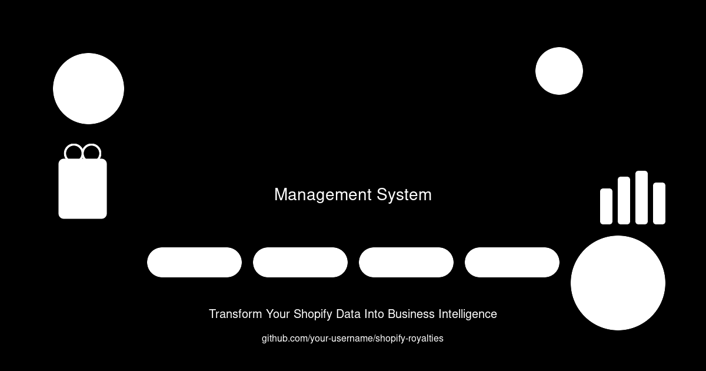

```
███████╗██╗  ██╗ ██████╗ ██████╗ ██╗███████╗██╗   ██╗    ██████╗  ██████╗ ██╗   ██╗ █████╗ ██╗  ████████╗██╗   ██╗
██╔════╝██║  ██║██╔═══██╗██╔══██╗██║██╔════╝╚██╗ ██╔╝    ██╔══██╗██╔═══██╗╚██╗ ██╔╝██╔══██╗██║  ╚══██╔══╝╚██╗ ██╔╝
███████╗███████║██║   ██║██████╔╝██║█████╗   ╚████╔╝     ██████╔╝██║   ██║ ╚████╔╝ ███████║██║     ██║    ╚████╔╝
╚════██║██╔══██║██║   ██║██╔═══╝ ██║██╔══╝    ╚██╔╝      ██╔══██╗██║   ██║  ╚██╔╝  ██╔══██║██║     ██║     ╚██╔╝ 
███████║██║  ██║╚██████╔╝██║     ██║██║        ██║       ██║  ██║╚██████╔╝   ██║   ██║  ██║███████╗██║      ██║   
╚══════╝╚═╝  ╚═╝ ╚═════╝ ╚═╝     ╚═╝╚═╝        ╚═╝       ╚═╝  ╚═╝ ╚═════╝    ╚═╝   ╚═╝  ╚═╝╚══════╝╚═╝      ╚═╝   
                                                                                                                    
    🛍️ SHOPIFY ROYALTIES MANAGEMENT SYSTEM 🛍️
    ═════════════════════════════════════════════════════════════════════════
    📊 Complete E-commerce Data Control & Business Intelligence Platform 📊
    ═════════════════════════════════════════════════════════════════════════
```

<div align="center">

### 🚀 **Transform Your Shopify Data Into Actionable Business Intelligence** 🚀

[](https://opensource.org/licenses/MIT)
[](https://opensource.org/licenses/MIT)
[](https://docker.com)
[](https://postgresql.org)
[](https://python.org)

**⚡ One-Command Setup** • **🤖 GitHub Copilot Ready** • **📱 Mobile Responsive** • **🔄 Auto-Sync**

</div>

---

## 🎯 **The Ultimate Shopify Royalties Management Solution**

A comprehensive Shopify data management system with automated backups, database storage, and web-based dashboards for complete e-commerce data control and royalties tracking.

## 📋 Table of Contents

- [Features](#-features)
- [Quick Start (with GitHub Copilot)](#-quick-start-with-github-copilot)
- [Manual Installation](#-manual-installation)
- [Configuration](#-configuration)
- [Usage](#-usage)
- [System Architecture](#-system-architecture)
- [API Reference](#-api-reference)
- [Troubleshooting](#-troubleshooting)
- [Contributing](#-contributing)

## 🚀 Features

### 📊 Complete Shopify Data Management
- **Full Data Sync**: Retrieves ALL orders, products, collections, and customer data
- **Organized File Structure**: Creates logical folder hierarchy matching Shopify organization
- **PostgreSQL Integration**: Stores all data in a structured database for advanced querying
- **Automated Backups**: Daily and hourly sync options with comprehensive logging

### 🖥️ Web-Based Dashboards
- **Interactive Database Viewer**: Browse all Shopify data through a modern web interface
- **pgAdmin Integration**: Full database administration capabilities
- **Real-time Monitoring**: Service status and health monitoring
- **Responsive Design**: Works on desktop, tablet, and mobile devices

### 🔄 Automation & Reliability
- **Systemd Integration**: Automatic startup after server reboot
- **Cronjob Scheduling**: Flexible scheduling for data sync operations
- **Error Handling**: Comprehensive error logging and recovery mechanisms
- **Service Monitoring**: Built-in health checks and status reporting

### 📈 Business Intelligence
- **Royalty Reports**: Automated generation of commission and royalty calculations
- **Sales Analytics**: Monthly and custom period sales reporting
- **Product Analysis**: Detailed product performance metrics
- **Customer Insights**: Customer behavior and purchase pattern analysis

## ⚡ Quick Start (with GitHub Copilot)

If you have **GitHub Copilot Pro** in VS Code, you can use our specialized setup guide:

👉 **[See COPILOT_SETUP.md](COPILOT_SETUP.md)** for automated installation

## 🔧 Manual Installation

### Prerequisites

- Ubuntu/Debian Linux server
- Python 3.8+ with pip
- Docker and Docker Compose
- PostgreSQL 12+ (or use our Docker setup)
- Root/sudo access for system configuration

### Step 1: Clone Repository

```bash
git clone https://github.com/PROTONORD/Protonord_no.git
cd Protonord_no
```

### Step 2: Run Setup Script

```bash
chmod +x setup.sh
sudo ./setup.sh
```

This will:
- Install all required Python packages
- Set up PostgreSQL database
- Configure Docker containers
- Create systemd services
- Set up automation

### Step 3: Configure Shopify API

```bash
cp config/shopify_config.template.py config/shopify_config.py
nano config/shopify_config.py
```

Add your Shopify credentials:
```python
SHOPIFY_STORE_URL = "your-store.myshopify.com"
SHOPIFY_ACCESS_TOKEN = "your-access-token"
```

### Step 4: Start Services

```bash
sudo systemctl start shopify-dashboard
sudo systemctl enable shopify-dashboard
```

### Step 5: Access Dashboards

- **Main Dashboard**: http://your-server:8080
- **Database Admin**: http://your-server:5050
- **API Documentation**: http://your-server:8080/api/docs

## ⚙️ Configuration

### Shopify API Setup

1. **Create Private App** in your Shopify admin
2. **Enable Required Permissions**:
   - Read orders
   - Read products
   - Read customers
   - Read collections
   - Read inventory

3. **Copy API Credentials** to config file

### Database Configuration

The system uses PostgreSQL with the following default settings:
- **Host**: localhost
- **Port**: 5433
- **Database**: shopifydata
- **User**: shopifyuser

Modify `config/database_config.py` for custom settings.

### Automation Settings

Configure sync frequency in `config/schedule_config.py`:
```python
HOURLY_SYNC_ENABLED = True
DAILY_BACKUP_ENABLED = True
BACKUP_TIME = "02:00"  # 2 AM daily backup
```

## 📖 Usage

### Initial Data Sync

```bash
# Full initial sync (may take several hours for large stores)
python3 organized_shopify_backup.py --full-sync

# Quick sync (orders from last 30 days)
python3 organized_shopify_backup.py --quick-sync
```

### Accessing Data

#### Web Dashboard
Visit `http://your-server:8080` to access the main dashboard with:
- Real-time sync status
- Data statistics
- Quick access to all tools

#### Database Access
- **pgAdmin**: `http://your-server:5050`
  - Email: admin@protonord.no
  - Password: admin123

#### File System
Organized files are stored in:
```
backup_data/
├── collections/
├── products/
├── orders/
│   ├── 2025/
│   │   ├── january/
│   │   ├── february/
│   │   └── ...
└── customers/
```

### Generating Reports

```bash
# Monthly sales report
python3 generate_monthly_sales_reports.py --month 2025-01

# Royalty calculations
python3 generate_royalty_reports.py --period 2025-01

# Custom product analysis
python3 generate_product_analysis.py --product-id 123456
```

### Service Management

```bash
# Check system status
./check_services.sh

# Start/stop services
sudo systemctl start shopify-dashboard
sudo systemctl stop shopify-dashboard

# View logs
tail -f logs/startup.log
tail -f logs/shopify_sync.log
```

## 🏗️ System Architecture

```
┌─────────────────┐    ┌──────────────────┐    ┌─────────────────┐
│   Shopify API   │◄──►│  Python Scripts  │◄──►│   PostgreSQL    │
└─────────────────┘    └──────────────────┘    └─────────────────┘
                               │                         │
                               ▼                         ▼
                       ┌──────────────────┐    ┌─────────────────┐
                       │  File System     │    │    pgAdmin      │
                       │  (Organized)     │    │   (Web UI)      │
                       └──────────────────┘    └─────────────────┘
                               │                         │
                               ▼                         ▼
                       ┌─────────────────────────────────────────┐
                       │          Web Dashboard                  │
                       │     (Bootstrap + JavaScript)           │
                       └─────────────────────────────────────────┘
```

### Core Components

- **organized_shopify_backup.py**: Main sync engine
- **PostgreSQL Database**: Structured data storage
- **Web Dashboard**: User interface for data access
- **pgAdmin**: Database administration
- **Systemd Services**: System integration and auto-start
- **Cron Jobs**: Scheduled automation

## 🔌 API Reference

### Shopify Data Endpoints

- `GET /api/products` - List all products
- `GET /api/orders` - List orders with pagination
- `GET /api/collections` - List all collections
- `GET /api/customers` - List customers

### System Status Endpoints

- `GET /api/status` - System health check
- `GET /api/sync/status` - Current sync status
- `POST /api/sync/trigger` - Manual sync trigger

### Reports Endpoints

- `GET /api/reports/sales` - Sales reports
- `GET /api/reports/royalty` - Royalty calculations

See full API documentation at: `http://your-server:8080/api/docs`

## 🔍 Troubleshooting

### Common Issues

#### "Permission denied" errors
```bash
sudo chown -R $USER:$USER /home/$USER/protonord_shopify_system
chmod +x *.sh
```

#### PostgreSQL connection failed
```bash
sudo systemctl restart postgresql
sudo systemctl status postgresql
```

#### Shopify API rate limits
The system automatically handles rate limits with exponential backoff. Check logs:
```bash
tail -f logs/shopify_sync.log
```

#### Services not starting
```bash
sudo systemctl daemon-reload
sudo systemctl reset-failed shopify-dashboard
sudo systemctl start shopify-dashboard
```

### Log Files

- **Main Application**: `logs/application.log`
- **Sync Operations**: `logs/shopify_sync.log`
- **System Startup**: `logs/startup.log`
- **Error Logs**: `logs/error.log`

### Debug Mode

Enable debug logging:
```bash
export SHOPIFY_DEBUG=1
python3 organized_shopify_backup.py
```

### Service Status

```bash
# Quick health check
./check_services.sh

# Detailed system status
systemctl status shopify-dashboard
docker ps
netstat -tlnp | grep -E "(5050|8080|5433)"
```

## 🛠️ Advanced Configuration

### Custom Sync Frequency

Edit `/etc/cron.d/shopify-sync`:
```bash
# Every 30 minutes during business hours
*/30 9-17 * * 1-5 /path/to/shopify_sync_cron.sh

# Daily full backup at 2 AM
0 2 * * * /path/to/daily_complete_backup.sh
```

### Database Optimization

For large datasets, optimize PostgreSQL:
```sql
-- Increase shared buffers
ALTER SYSTEM SET shared_buffers = '256MB';

-- Increase work memory
ALTER SYSTEM SET work_mem = '16MB';

-- Reload configuration
SELECT pg_reload_conf();
```

### Security Configuration

1. **Change default passwords**:
   ```bash
   # pgAdmin password
   docker exec -it pgadmin python setup.py --set-password
   
   # Database password
   sudo -u postgres psql -c "ALTER USER shopifyuser PASSWORD 'new_secure_password';"
   ```

2. **Firewall setup**:
   ```bash
   sudo ufw allow 8080/tcp  # Dashboard
   sudo ufw allow 5050/tcp  # pgAdmin (optional - for remote access)
   ```

3. **SSL/TLS Configuration** (recommended for production):
   See `docs/ssl_setup.md` for detailed instructions.

## 🔧 Development

### Running Tests

```bash
# Unit tests
python3 -m pytest tests/

# Integration tests
python3 test_organized_backup_db.py

# System tests
./test_reboot.sh
```

### Code Structure

```
src/
├── core/
│   ├── shopify_client.py      # Shopify API wrapper
│   ├── database_manager.py    # PostgreSQL operations
│   └── file_organizer.py      # File system operations
├── web/
│   ├── dashboard.py           # Web dashboard backend
│   └── api_routes.py          # REST API endpoints
├── reports/
│   ├── sales_reports.py       # Sales analytics
│   └── royalty_calculator.py  # Commission calculations
└── utils/
    ├── logging_config.py      # Centralized logging
    └── error_handler.py       # Error management
```

### Contributing

1. Fork the repository
2. Create a feature branch: `git checkout -b feature/amazing-feature`
3. Commit changes: `git commit -m 'Add amazing feature'`
4. Push to branch: `git push origin feature/amazing-feature`
5. Open a Pull Request

## 📞 Support

### Documentation
- **Full Documentation**: [docs/](docs/)
- **API Reference**: [docs/api.md](docs/api.md)
- **Installation Guide**: [docs/installation.md](docs/installation.md)

### Community
- **Issues**: [GitHub Issues](https://github.com/PROTONORD/Protonord_no/issues)
- **Discussions**: [GitHub Discussions](https://github.com/PROTONORD/Protonord_no/discussions)

### Commercial Support
For enterprise support and custom development:
- **Email**: support@protonord.no
- **Website**: https://protonord.no

## 📄 License

This project is licensed under the MIT License - see the [LICENSE](LICENSE) file for details.

## 🏷️ Version History

- **v2.1.0** (2025-09-20)
  - Added automated startup system
  - Improved error handling
  - Enhanced web dashboard
  - PostgreSQL integration

- **v2.0.0** (2025-09-15)
  - Complete system rewrite
  - Added web-based management
  - Implemented database storage
  - Added comprehensive logging

- **v1.0.0** (2025-09-01)
  - Initial release
  - Basic Shopify sync functionality
  - File-based organization

---

**Made with ❤️ by PROTONORD**

*Transform your Shopify data into actionable business intelligence*